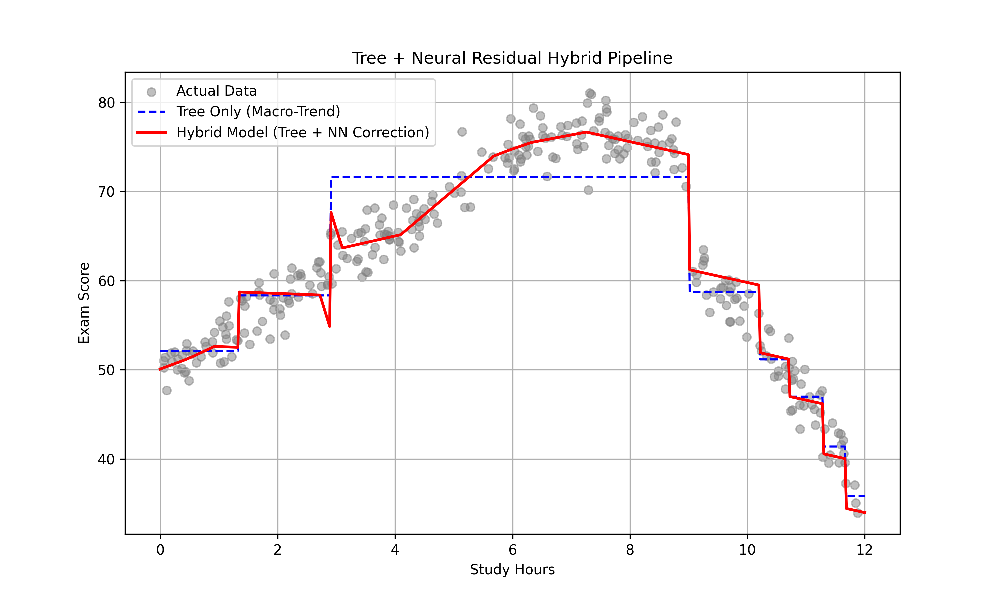

# Tree-Neural Residual Hybrid Pipeline 🌳➕🧠

A hybrid regression pipeline that combines an **interpretable Decision Tree base model** with a **PyTorch Multi-Layer Perceptron (MLP) residual correction layer**. The tree captures the global, macro-level trend in the data while the neural network learns to correct the leftover non-linear errors the tree alone cannot represent — giving you both interpretability and the modeling power of a neural net.



## Overview

Traditional decision trees are easy to interpret but produce blocky, step-function predictions that struggle with smooth non-linear relationships. This project addresses that limitation with a two-stage **residual learning** approach:

1. **Stage 1 — Base Model:** A `DecisionTreeRegressor` (scikit-learn) is fit on the raw data to capture the overall global trend.
2. **Stage 2 — Residual Correction:** The leftover errors (residuals) between the tree's predictions and the true targets are computed, and a lightweight 3-layer MLP (PyTorch) is trained specifically to predict those residuals.
3. **Final Prediction:** `tree_prediction + nn_residual_correction`

This setup is demonstrated on a synthetic dataset modeling student exam performance as a function of study hours, which includes deliberately engineered non-linear effects: diminishing returns after 6 hours of study and an additional cramming penalty beyond 9 hours.

## Architecture

| Component | Details |
|---|---|
| Base Model | `DecisionTreeRegressor` (scikit-learn), max depth = 3 |
| Residual Model | 3-layer MLP (PyTorch): `Linear → ReLU → Linear → ReLU → Linear` |
| Hidden Layers | 32 units → 16 units |
| Optimizer | Adam, learning rate = 0.01 |
| Loss Function | Mean Squared Error (MSE) |
| Training Epochs | 500 |
| Dataset | 300 synthetic data points (study hours vs. exam score) |

## Project Structure

```
tree-neural-residual-hybrid/
├── main.py                  # Pipeline: data generation, training, prediction, plotting
├── models/
│   ├── __init__.py
│   └── residual_nn.py       # ResidualNN: the PyTorch MLP architecture
├── requirements.txt         # Project dependencies
├── results_vis.png          # Generated output plot (created by main.py)
├── .gitignore
├── LICENSE
└── README.md
```

## Installation

```bash
git clone https://github.com/<your-username>/tree-neural-residual-hybrid.git
cd tree-neural-residual-hybrid
pip install -r requirements.txt
```

## Usage

Run the full pipeline — this generates the synthetic dataset, trains the tree, trains the residual network, and produces the comparison plot:

```bash
python main.py
```

This will:
- Generate 300 synthetic (study hours, exam score) data points
- Fit the `DecisionTreeRegressor` to the data
- Compute residuals and train the `ResidualNN` to correct them
- Save a visualization to `results_vis.png` comparing the tree-only prediction against the full hybrid prediction

## How It Works

```python
from models.residual_nn import ResidualNN
from main import TreeNeuralHybridPipeline

pipeline = TreeNeuralHybridPipeline(max_depth=3, lr=0.01, epochs=500)

X, y = pipeline.generate_data(n_samples=300)
pipeline.fit(X, y)

predictions = pipeline.predict(X)
pipeline.plot_results(X, y)
```

## Results

The plot below shows three things on the synthetic study-hours-vs-exam-score dataset:

- **Gray points** — the raw, noisy data
- **Blue dashed line** — the decision tree's blocky, step-wise approximation of the macro trend
- **Red line** — the full hybrid model's smoothed prediction after the neural network corrects the tree's residual errors

The hybrid model successfully smooths out the tree's step-function artifacts and tracks the diminishing-returns and cramming-penalty effects far more closely than the tree alone.

## Requirements

- Python 3.8+
- numpy >= 1.22.0
- torch >= 1.11.0
- scikit-learn >= 1.0.0
- matplotlib >= 3.5.0

## License

This project is licensed under the MIT License — see the [LICENSE](LICENSE) file for details.
